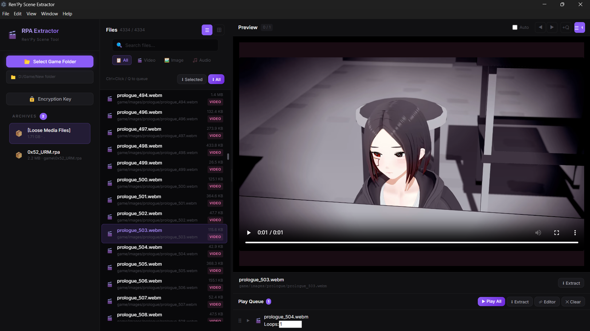
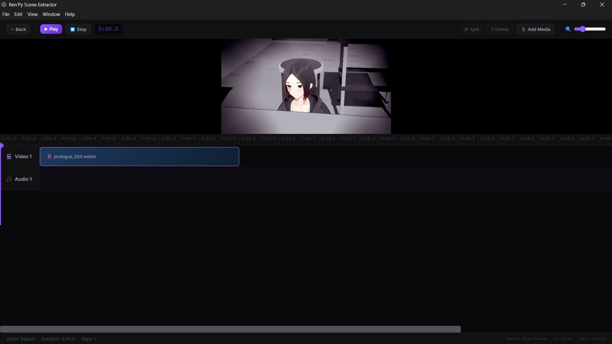

# Ren'Py Scene Extractor

Desktop app untuk browse, preview, extract, queue, edit, dan export media dari game Ren'Py (`.rpa`) dan loose media files.

## Important / Disclaimer

Gunakan tool ini hanya untuk penggunaan yang sah:

- proyek milik Anda sendiri,
- proyek yang Anda punya izin untuk analisis/extract,
- atau konten yang memang boleh dipakai.

Repository ini **tidak menyertakan asset game apa pun**.
Jangan upload hasil extract game pihak ketiga ke repository ini.

---

## Highlights

- Scan folder game Ren'Py dan tampilkan daftar archive `.rpa`
- Support **RPA-2.0**, **RPA-3.0**, dan **RPA-3.2**
- Browse **loose media files** di folder game
- Preview **video / image / audio** langsung dari archive atau file lokal
- Multi-select file, queue playback, loop per item
- Timeline editor dengan:
  - trim
  - split
  - duplicate
  - reorder
  - close gaps untuk video/image
  - stacked audio tracks (`Audio 2`, `Audio 3`, dst.)
  - preview fullscreen
- Export timeline menjadi **1 file video MP4 final**
- Bundled FFmpeg support untuk release build

---

## Screenshots

### Main Interface


### Timeline Editor


---

## User Features

### Main Workspace

- Hideable/collapsible sidebar
- Archive/game list dengan remove button
- File browser dengan:
  - search
  - type filter (`All / Video / Image / Audio`)
  - list/grid mode
- Selection tray untuk:
  - **Queue Selected**
  - **Extract Selected**
  - **Extract All**
  - **Help**

### Preview Panel

- Custom preview player
- Prev/next scene controls
- Fullscreen preview support
- Auto-play next
- Queue-aware playback
- Overlay play/pause auto-hide

### Play Queue

- Reorder by drag
- Loop count per item
- Play all queue items
- Open queue in timeline editor

### Timeline Editor

- Separate `Video` track + dynamic audio tracks
- Drag clips on timeline
- Drag edge handles to trim
- Split at playhead
- Duplicate selected clip
- Reorder clips earlier/later
- Close gaps for video/image only
- Audio clips can overlap by moving them to lower audio tracks
- Selected Clip section is collapsible
- Preview area supports resize + fullscreen
- Timeline draft persists when leaving/re-entering editor

---

## Supported Preview Types

### Video

- `webm`
- `mp4`
- `mkv`
- `avi`
- `ogv`
- `mov`
- `flv`

### Image

- `png`
- `jpg`
- `jpeg`
- `gif`
- `bmp`
- `webp`
- `tga`

### Audio

- `mp3`
- `wav`
- `ogg`
- `flac`
- `aac`
- `opus`

> Jika audio ada di game tapi tidak muncul di filter Audio, besar kemungkinan file memakai format/ekstensi lain yang belum masuk daftar di atas.

---

## Keyboard Shortcuts

### Main App

| Key | Action |
|-----|--------|
| `↑ / ↓ / ← / →` | Navigate files or queue based on current nav target |
| `A / D` | Prev / next scene in custom preview |
| `Q` | Import selected files to play queue |
| `?` | Toggle help guide |
| `Ctrl+Click` | Toggle multi-select |
| `Shift+Click` | Range select |

### Timeline Editor

| Key | Action |
|-----|--------|
| `Space` | Play / pause |
| `S` | Split at playhead |
| `D` | Duplicate selected clip |
| `Alt+← / →` | Reorder selected clip |
| `Delete` | Delete selected clip |

---

## Encryption Keys

Beberapa archive Ren'Py terenkripsi.
Kalau archive gagal dibuka (mis. error zlib / pickle), Anda mungkin perlu memasukkan **hex key**.

Gunakan hanya key yang memang Anda berhak pakai.

---

## Build / Run

## Requirements

- Node.js
- npm
- Python 3 tersedia di PATH sebagai `python`

### Install dependencies

```bash
npm install
```

### Run dev mode

```bash
npm run dev
```

### Build app bundles

```bash
npm run build
```

### Build Windows installer

```bash
npm run dist
```

Output:

```text
release/1.0.0/
```

Windows installer name:

```text
RenPy Scene Extractor-Windows-1.0.0-Setup.exe
```

---

## FFmpeg for Export

Untuk release build, project ini sekarang mendukung **bundled FFmpeg essentials**.

Letakkan file FFmpeg di:

```text
vendor/ffmpeg/bin/ffmpeg.exe
vendor/ffmpeg/bin/ffprobe.exe
```

Builder akan membundelnya ke:

```text
resources/ffmpeg/bin/
```

Saat runtime:

1. app akan mencari FFmpeg bundled terlebih dahulu
2. jika tidak ada, app fallback ke `PATH`

---

## Export Notes

- Export timeline menghasilkan **1 file MP4 final**, bukan file terpisah.
- Export backend membutuhkan FFmpeg.
- Jika FFmpeg tidak ditemukan, app akan menampilkan error yang jelas.

---

## Temp File Behavior

Preview/editor extraction sekarang memakai **session temp directory**, bukan folder temp shared lama yang terus menumpuk.

- preview temp dibuat di bawah `%TEMP%/rpa-extractor/session-*`
- session aktif dibersihkan saat app quit normal
- startup punya janitor cleanup untuk session orphan yang sudah stale

---

## Troubleshooting

### Audio ada di game tapi tidak muncul di filter Audio

Kemungkinan:

- file audio berada di archive lain yang belum dibuka,
- file itu termasuk loose media tapi belum ter-scan di folder yang dipilih,
- atau format audio-nya belum termasuk daftar format audio yang didukung tool.

### Video / audio preview tidak bunyi / tidak jalan

Beberapa format media tidak sepenuhnya kompatibel dengan player Chromium/Electron.
Kalau file bisa diputar di VLC tapi tidak normal di app, biasanya itu masalah kompatibilitas codec/pixel format.

### Export gagal karena FFmpeg tidak ditemukan

Pastikan salah satu kondisi ini terpenuhi:

- FFmpeg bundled ada di `vendor/ffmpeg/bin/` sebelum build, atau
- `ffmpeg` dan `ffprobe` tersedia di `PATH`

### Python tidak ditemukan

Pastikan `python` bisa dipanggil dari terminal:

```bash
python --version
```

---

## License

MIT License
